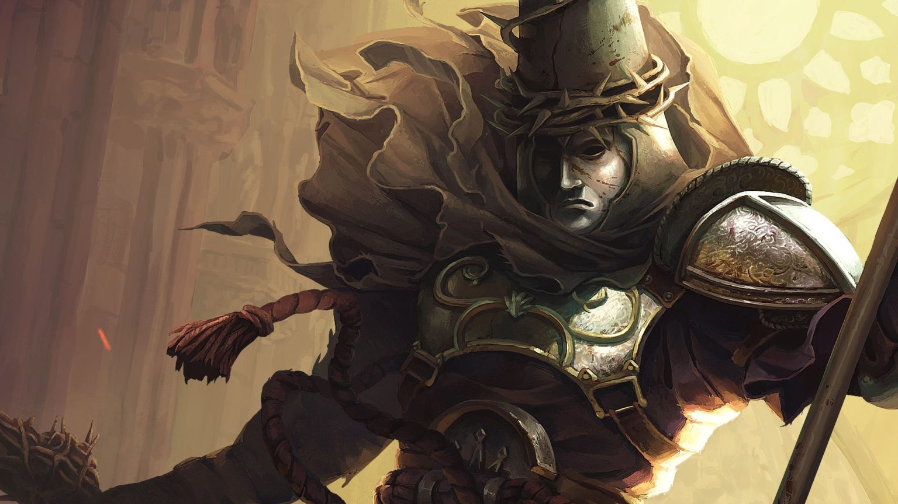

# Blasphemous : Un juego Español

Si te atraen los videojuegos desafiantes, oscuros y llenos de simbolismo, *Blasphemous* es una obra que no puedes ignorar. Este título, desarrollado por **The Game Kitchen**, combina el estilo *Metroidvania* con una narrativa inspirada en la cultura religiosa del sur de España.  

## Una Historia de Penitencia y Sacrificio

En *Blasphemous*, encarnas al Penitente, el último sobreviviente de la Hermandad del Lamento Mudo. Te enfrentas a un mundo decadente y lleno de horrores, donde deberás desentrañar los misterios de la *Milagrosa Aflicción*, una fuerza divina que ha transformado la tierra de Cvstodia en un lugar de sufrimiento eterno.

## Arte Pixelado con Alma

El juego destaca por su detallado arte en *pixel art*. Desde los enemigos grotescos hasta los escenarios cargados de simbología, cada elemento visual refuerza la atmósfera opresiva del juego. Inspirado en la Semana Santa y el arte barroco, *Blasphemous* convierte el pecado y la penitencia en una experiencia estética única.

## Jugabilidad Retadora

*Blasphemous* ofrece un combate visceral y preciso, donde los errores se pagan caro. Tendrás que dominar tus habilidades, encontrar mejoras y explorar un mapa interconectado lleno de secretos. Perfecto para quienes disfrutan títulos como *Dark Souls* o *Hollow Knight*.

## Éxito Indie

Desde su lanzamiento, el juego ha recibido elogios por su diseño, narrativa y atmósfera. Tanto los jugadores como los críticos han reconocido su capacidad para mezclar elementos culturales con una jugabilidad desafiante y cautivadora.
