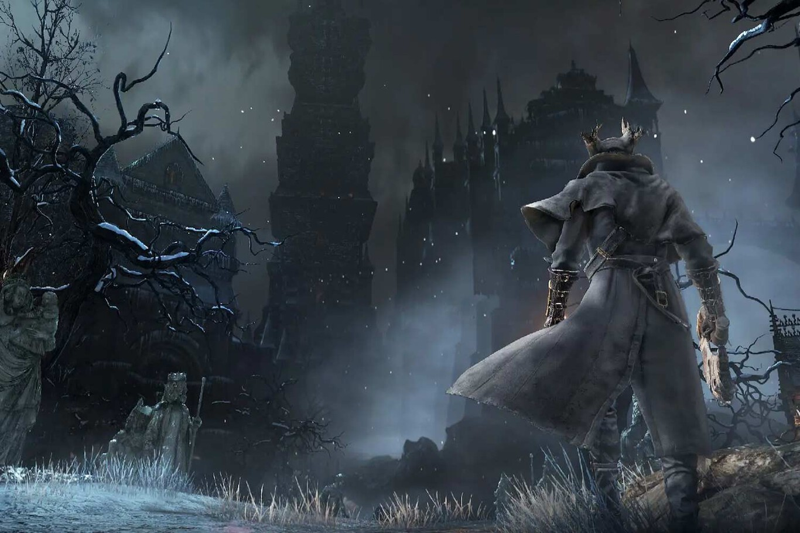

+++
title = 'PostRodrigo'
date = 2024-11-29T09:44:45+01:00
draft = false
+++

## Introducción

Lanzado en 2015 por FromSoftware, **Bloodborne** es un videojuego exclusivo para PlayStation que ha dejado una huella imborrable en el género de acción y horror. Con su ambientación gótica, combates desafiantes y narrativa enigmática, este título se ha convertido en un clásico (god).

---

## Historia

La trama de Bloodborne se desarrolla en **Yharnam**, una ciudad oscura plagada por una enfermedad que transforma a sus habitantes en bestias monstruosas. Como jugador, asumes el rol de un cazador que busca la verdad detrás de esta maldición, enfrentándose a horrores indescriptibles y descubriendo secretos ocultos.

### Temas Principales
- **Horror cósmico**: Influenciado por H.P. Lovecraft.
- **Corrupción humana**: La línea entre hombre y monstruo.
- **Misterio**: La historia se revela a través de objetos y escenarios.

---

## Jugabilidad

Bloodborne combina elementos de rol y acción con un enfoque en combates rápidos y estratégicos. 

### Características Clave
- **Estilo de combate agresivo**: Esquivar y atacar reemplazan la defensa pasiva.
- **Armas transformables**: Diseñadas para adaptarse a diferentes estilos de lucha.
- **Exploración**: Un mundo interconectado lleno de desafíos y secretos.

### Dificultad
- Fiel a la tradición de FromSoftware, **la dificultad de Bloodborne es alta**, pero recompensa a los jugadores con una sensación única de logro tras superar sus retos.

---

## Impacto y Legado

Desde su lanzamiento, Bloodborne ha sido elogiado por:
- **Su diseño artístico**: Inspirado en la era victoriana.
- **La banda sonora**: Oscura y majestuosa.
- **La experiencia inmersiva**: Una mezcla perfecta de acción, terror y misterio.

Es considerado uno de los mejores videojuegos de todos los tiempos y ha influido en títulos posteriores como *Elden Ring*.

---

## Conclusión

Bloodborne no es solo un videojuego; es una obra maestra que desafía y cautiva a sus jugadores. Si eres amante de los retos y buscas una experiencia inolvidable, Yharnam te espera.

---

¿Te atreves a convertirte en cazador? 🩸